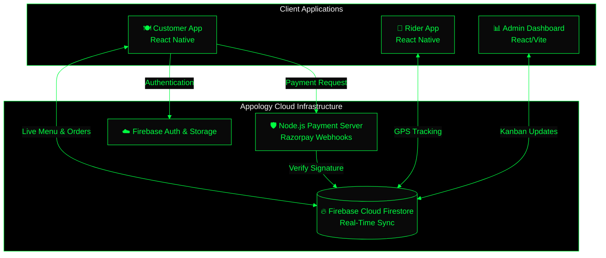

  <!-- Matrix Cylinder Header with Twinkling Animation (No Wave) -->
  

  <h2 align="center">Building the Future of the Web.</h2>

  

    
  

  

    
    
    
  

<table align="center" width="100%">
  <tr>
    <td align="center" width="50%" valign="top">
      <h3>🏢 Who We Are</h3>
      

        <strong>Appology Inc.</strong> is a next-generation software engineering organization focused on creating highly scalable, cinematic, and deeply integrated applications.   
        We specialize in complex monorepo architectures, real-time data pipelines, and pushing the visual limits of what the modern web can do.
      

    </td>
    <td align="center" width="50%" valign="top">
      <h3>🚀 Our Core Expertise</h3>
      

        📱 <strong>Cross-Platform Mobile:</strong> React Native & Expo  
        ⚡ <strong>Blazing Fast Web:</strong> React 18, Next.js, Vite  
        🔥 <strong>Cloud Infrastructure:</strong> Firebase Ecosystem & Node.js  
        🛡 <strong>Secure Architecture:</strong> FinTech Integrations & Real-Time Sync
      

    </td>
  </tr>
</table>

  <h2>🌟 Featured Ecosystem: Anjani Restaurant</h2>
  
Our flagship, multi-app food delivery platform powering the modern restaurant.

  
  
    
  

    
  

  <h2>🌐 Global System Architecture</h2>
  
The core infrastructure powering Appology Inc. deployments.

 

  <h3>⚡ Technologies We Master</h3>
  <!-- Monochrome/Dark tech icons for a highly masculine look -->
  

  <h3>Let's Build Something Incredible.</h3>
  

